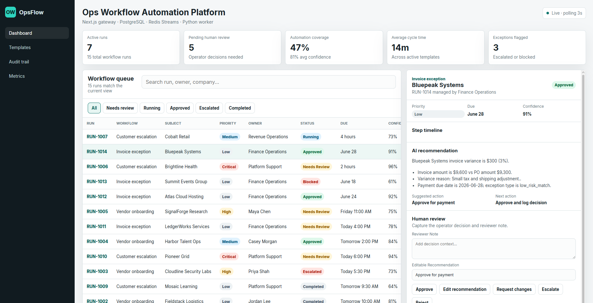

# Ops Workflow Automation Platform

[](https://github.com/Daniel5569/ops-workflow-automation-platform/actions/workflows/ci.yml)



[](LICENSE)

**[→ Live Demo](https://ops-workflow-automation-platform.vercel.app)** · **[→ GitHub](https://github.com/Daniel5569/ops-workflow-automation-platform)**

An AI-assisted operations console that routes vendor approvals, customer escalations, and invoice exceptions through deterministic evaluation, human review gates, and a persistent audit trail.

## Business Problem

Ops decisions scattered across email, spreadsheets, and Slack go untracked and unaudited. A single missed vendor approval or undocumented escalation can delay a deal, trigger a compliance finding, or result in a duplicate payment.

This platform centralises the queue, generates an AI recommendation for each workflow, requires a human review decision before any action is finalised, and writes every state transition to a persistent audit log — so nothing falls through the cracks and everything is traceable.

**Problem solved**: Ops work scattered across email, spreadsheets, and Slack means decisions go untracked, approvals get lost, and there is no repeatable process. This platform gives ops teams a structured queue with AI-generated recommendations, human-in-the-loop controls, and a full audit log — all in one place.

---

## Live demo

> **[https://ops-workflow-automation-platform.vercel.app](https://ops-workflow-automation-platform.vercel.app)**

The demo runs on Vercel (Next.js gateway) backed by Neon PostgreSQL and Upstash Redis. It loads 15 pre-seeded workflow runs across three types. You can:

- Browse the queue, filter by status or type, and open any run for its AI recommendation and step timeline
- Submit a review decision (approve / escalate / reject / request changes) — the action is written to PostgreSQL and appears in the audit log immediately
- Create a new workflow from the template gallery and watch it enter the queue at `running` status

---

## Architecture

```
┌───────────────────────────────────────┐
│  Browser                              │
│  React 19 (Next.js App Router)        │
│  Workflow queue · KPI strip           │
│  Human review · Audit log             │
└──────────────┬────────────────────────┘
               │ HTTP / REST
┌──────────────▼────────────────────────┐
│  Next.js 15 — API Gateway (TS)        │
│  POST /api/workflows   (create)       │
│  GET  /api/workflows   (list)         │
│  GET  /api/workflows/:id              │
│  POST /api/workflows/:id/review       │
│                                       │
│  Zod input validation                 │
│  Prisma ORM → PostgreSQL              │
│  ioredis → Redis Stream XADD         │
└──────┬───────────────────┬────────────┘
       │ Prisma            │ XADD workflow:pending
┌──────▼──────────┐ ┌──────▼──────────────────────┐
│  PostgreSQL     │ │  Redis                       │
│  WorkflowRun    │ │  Stream: workflow:pending    │
│  AuditEvent     │ │  Stream: workflow:dlq        │
│  WorkflowStep   │ │  Consumer group: processors  │
└──────┬──────────┘ └──────┬──────────────────────┘
       │ psycopg2          │ XREADGROUP
┌──────▼───────────────────▼──────────────────────┐
│  Python 3.12 / FastAPI Worker                   │
│  Consumer group loop (XREADGROUP + XACK)        │
│  Workflow evaluation engine (port of TS logic)  │
│  Retry with exponential backoff (max 3)         │
│  Dead-letter → workflow:dlq after 3 failures    │
│  GET /health  (FastAPI healthcheck endpoint)    │
└─────────────────────────────────────────────────┘
```

**Production** (Vercel): Neon PostgreSQL (pgBouncer pooled URL + direct URL for migrations), Upstash Redis (TLS).

**Local / Docker**: PostgreSQL 16 + Redis 7 via Docker Compose.

---

## Quick start

### Option A — live demo

Visit **[https://ops-workflow-automation-platform.vercel.app](https://ops-workflow-automation-platform.vercel.app)** — no setup required.

### Option B — Docker (full stack locally)

```bash
git clone https://github.com/Daniel5569/ops-workflow-automation-platform
cd ops-workflow-automation-platform

cp .env.example .env          # default postgres:postgres credentials

docker compose up -d postgres redis worker

docker compose run --rm migrate   # runs prisma migrate deploy + seed

docker compose up -d gateway

open http://localhost:3000
```

### Option C — local dev (Postgres + Redis already running)

```bash
npm install
npx prisma migrate dev
npx prisma db seed
npm run dev

# In a separate terminal:
cd worker && pip install -r requirements.txt && python main.py
```

---

## Workflow types

| Type | What it does |
|------|-------------|
| **Vendor onboarding** | Scores risk from spend + documentation status, flags missing MSA/tax form |
| **Customer escalation** | Assigns priority, SLA, and team based on tier + sentiment + ARR impact |
| **Invoice exception** | Classifies variance (major/minor/policy) and recommends approve/hold/escalate |

Each run flows through: `running → needs_review → approved / escalated / rejected / failed`

---

## Tech stack

| Layer | Technology |
|-------|-----------|
| Frontend | Next.js 15 (App Router), React 19, TypeScript |
| API gateway | Next.js API routes, Zod validation, Prisma 5 |
| Database | PostgreSQL 16 — Neon (prod), Docker (local) |
| Queue | Redis Streams (consumer groups, dead-letter) — Upstash (prod), Docker (local) |
| Worker | Python 3.12, FastAPI, psycopg2, redis-py |
| Tests | Vitest (TS), pytest (Python) |
| Infrastructure | Docker Compose (4 services with healthchecks) |
| CI | GitHub Actions (lint + test for TS and Python, Docker smoke test) |
| Hosting | Vercel (gateway), Neon (PostgreSQL), Upstash (Redis) |

---

## Repository structure

```
├── app/
│   ├── page.tsx                  # Main ops console (React client)
│   └── api/workflows/            # REST API routes (Next.js)
├── components/                   # WorkflowQueue, RunDetailPanel, etc.
├── lib/
│   ├── workflow-engine.ts        # Deterministic evaluation logic (TS)
│   ├── workflow-types.ts         # Shared TypeScript types
│   ├── prisma.ts                 # Prisma client singleton
│   ├── redis.ts                  # ioredis singleton (TLS-aware for Upstash)
│   └── streams.ts                # Redis Streams publish helper
├── prisma/
│   ├── schema.prisma             # Database schema (enums + 3 models)
│   ├── migrations/               # SQL migration history
│   └── seed.ts                   # Demo data seed (15 runs, 38 audit events)
├── worker/
│   ├── main.py                   # Consumer loop + FastAPI health endpoint
│   ├── engine.py                 # Evaluation engine (Python port of TS logic)
│   ├── db.py                     # PostgreSQL connection pool
│   └── tests/test_engine.py      # pytest suite (mirrors TS test cases)
├── tests/workflow-engine.test.ts # Vitest suite
├── docker-compose.yml
└── .github/workflows/ci.yml      # CI: lint, test, Docker smoke
```

---

## Running tests

```bash
# TypeScript (Vitest)
npm test

# Python (pytest)
cd worker && pytest tests/ -v

# TypeScript with coverage
npm run test:coverage
```

---

## Portfolio context

This repo is part of a portfolio of AI-focused architecture demos. The other repos in the set use the same gateway → queue → worker pattern: a Next.js TypeScript gateway writes to PostgreSQL and publishes to Redis Streams; a Python/FastAPI consumer group evaluates or enriches the payload and writes results back to PostgreSQL. This repo applies that pattern to an ops automation use case — human-in-the-loop workflow review with structured audit logging.
## Architecture Decisions FAQ

**Q: Why split the gateway (Node.js/Next.js) from the worker (Python/FastAPI) instead of one service?**

The gateway handles HTTP, authentication, React SSR, and database writes — tasks where the Node.js/Next.js ecosystem is mature and the deployment surface is well understood (Vercel or any Node host). The worker runs business logic that benefits from Python: rules engines, classification models, and integration with Python-native data libraries. Merging them would mean either running Python inside a Node process (fragile) or running Node inside a Python process (unnatural for SSR). The two-service split keeps each runtime doing what it is optimized for at the cost of one internal network hop.

**Q: What happens to an in-flight workflow run if the Python worker pod crashes?**

Redis Streams consumer groups track message acknowledgment. A message is not removed from the stream until the worker explicitly calls XACK. If the worker crashes before acknowledging, the message stays in the pending-entries list (PEL) with a delivery counter. A separate XCLAIM sweep (configurable; omitted from the demo for simplicity) reclaims messages that have been pending longer than a threshold and redelivers them. The workflow run row in PostgreSQL remains in `processing` status — the new worker picks it up and overwrites the result idempotently.

**Q: Why Redis Streams instead of PostgreSQL-backed queuing?**

PostgreSQL-backed queues (pg-boss, SKIP LOCKED patterns) work well and reduce the dependency count. Redis Streams were chosen here because they make consumer group semantics — multiple workers, at-least-once delivery, pending-entries visibility, dead-letter routing — explicit in the data model rather than implemented in application code. The tradeoff is an extra infrastructure component; the benefit is that the queue state is inspectable with standard Redis tooling without writing custom SQL.

**Q: Why human-in-the-loop review for AI recommendations instead of auto-applying high-confidence ones?**

Auto-applying recommendations in an ops context means a model error becomes an ops incident without a human in the approval chain. The current design routes all recommendations through a review queue regardless of confidence score. A production deployment would add a configurable auto-approve threshold for low-risk action types — but the threshold and action-type allowlist are explicit policy decisions, not defaults. Starting with mandatory review and relaxing it intentionally is safer than starting with auto-apply and adding review after an incident.

**Q: What kinds of ops workflows does this automate in practice?**

The demo uses a generic workflow type to show the infrastructure pattern: event intake, async evaluation, structured recommendation, human review, and audit logging. In a real deployment, workflow types map to specific ops processes — approval routing for out-of-policy expenses, triage classification for support escalations, change-order risk scoring for project management. The Python engine is designed to be extended with new workflow type handlers that follow the same evaluate/recommend contract without changing the gateway or the database schema.
